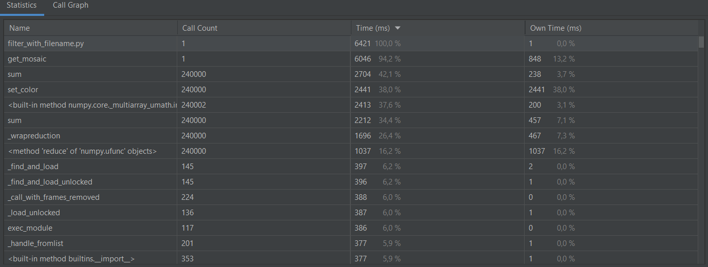

# refactoring17-2
## Время выполнения файлов:
### Время выполнения old_filter.py:

### Время выполнения filter.py:

### Время выполнения filter_with_filename.py:

## Исходное изображение:

## Изображение после ***old_filter.py***:

## Изображение после ***filter_with_filename.py***:

# Doc-тестов нет.
